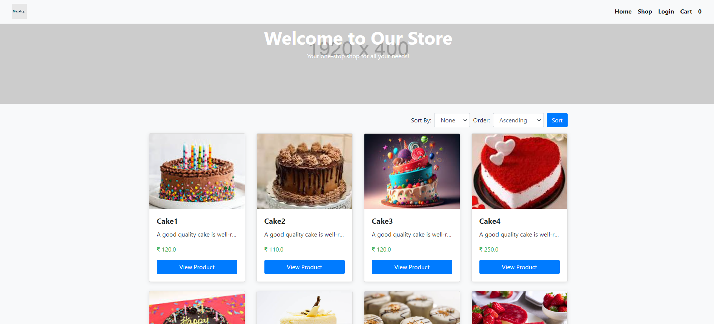
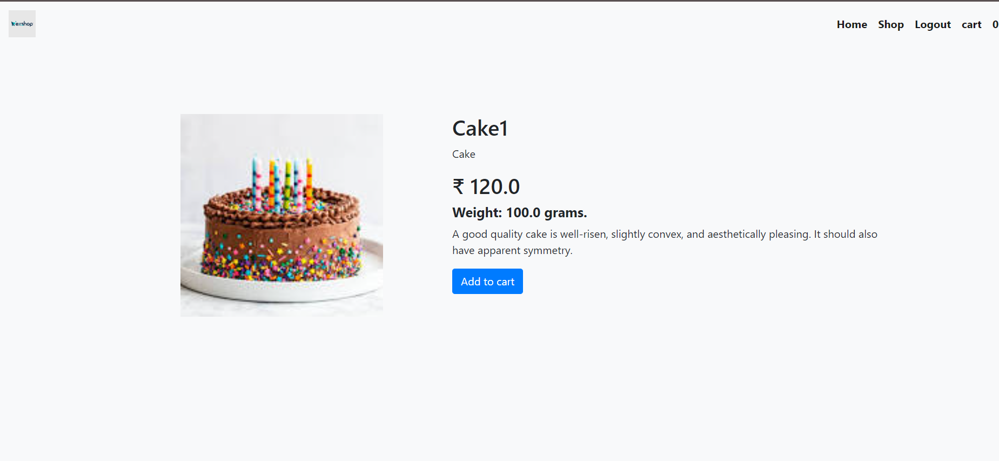

# E-Commerce Website with Spring Boot and OAuth2 Authentication
##  Overview
This project is an e-commerce web application developed using Spring Boot. 
It includes user login functionality with OAuth2 (Google Sign-In), session management, and admin-specific routes.
The app allows users to browse and purchase products, while the admin has specific privileges to manage the products and orders.

## Project Screenshot

